# Aether

**Aether** is a complete solution for AI tuning of cars with open-source ECUs (FOME / rusEFI / Speeduino / MegaSquirt-class). It turns cheap (< $50) off-the-shelf **ESP32** hardware into a kick-ass AFR gauge and logger that, once plugged into the ECU's USB port, is also a **remote programmer**. Aether is designed to make it easy for AIs such as Claude Code, Grok Build, Cursor, etc... to read the logs and the full calibration and figure out the optimal way to fix a tuning problem or find real performance improvements.

This repository is a product GCU (General Contact Unit) used with [Silico](https://github.com/tig/silico). 

| Host AFR face mockup | Bootstrap board: Waveshare ESP32-S3-Touch-AMOLED-1.8 |
|:---:|:---:|
|  | 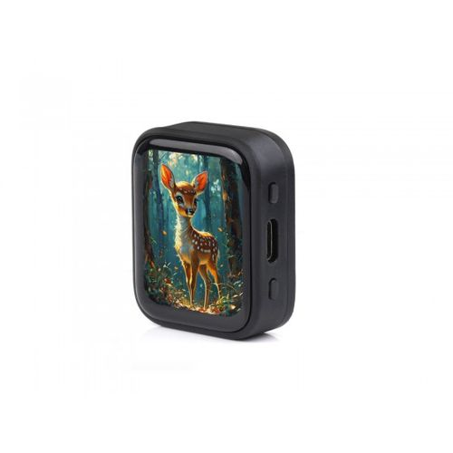 |

## Vision

> "My '87 528e has a custom 2.9L stroker motor and runs a Classic Daily 55-pin Standalone ECU. I've been struggling to get the car to perform well after a cold-start. It's great when warm. I am not a tuner, nor do I know (or care to know) how TunerPro works." said, Tig Kindel, an E28 enthusiast. "I plugged Aether into the USB port on the Classic Daily ECU and it instantly showed that it was connected. I started the car and limped around the block (because off the cold-start issue). While I was driving Aether showed me the AFR, RPM, and throttle info in real time on the tiny display. After the drive, I left the car powered on (not running, just so the ECU had power) and started Grok Build on my PC. I told grok to find the Aether device and to diagnose the logs from the latest drive. Grok found the device, read the logs, and then proposed changes to my tune. Burning the new calibration was as easy as telling Grok to do it. After letting the car cool down again, my next drive was perfect. Problem fixed!". 

### Cheap, Easy To Use AFR Gauge and Logger

Dial + value + lambda + RPM/TPS on a small touch AMOLED, legible in a car at a glance ([specs/afr-face.md](specs/afr-face.md)). **This layer is the part that exists today**, as a mockup (GIF above).

The **current bootstrap board** is the **Waveshare ESP32-S3-Touch-AMOLED-1.8** — full specs in [Hardware](#hardware) below. (The unit actually on the bench was bought on Amazon under the **UeeKKoo** label [ASIN B0F242GFHK] — same ESP32-S3R8/SH8601/FT3168 design, just a rebrand at roughly double Waveshare's direct price; Waveshare's own docs/example code apply either way.) It's not the only board this is meant for: the product intent is to run on a **wide range of off-the-shelf hardware**, not lock to a single SKU. Several other **self-contained** boards — some ESP32-S3, some meaningfully more powerful ESP32-P4 or RP2350 designs — share enough of the same display/touch stack or exceed this board's specs outright that portability is realistic rather than aspirational — see the candidate tables in [Hardware](#hardware).

### Live ECU Link

Aether as a client of the protocols open ECUs already speak (TunerStudio-compatible newserial: rusEFI / **FOME** / MegaSquirt / Speeduino), over **USB first**, then UART, then wireless. Pilot target is the operator's own **FOME**-based car, plugged into Aether over USB with no PC in the middle. Design: [issue #5](https://github.com/tig/aether/issues/5).

### Always-On Logging

Logging starts by default, tags drives, and lets the operator drop voice/button **event marks** ("mark that lean spike") without ritual. Canonical on-device format is **MLVLG (`.mlg`)** so sessions open natively in MegaLogViewer, with **first-class export to Innovate LogWorks** so a remote tuner can open the file without installing Aether's own tools. Design: [issue #2](https://github.com/tig/aether/issues/2), [issue #3](https://github.com/tig/aether/issues/3).

### Remote Programmer: Full Calibration Read/Write

Not just fuel maps: cold-start/cranking/ASE/WUE curves, idle, protections, every burnable scalar, table, and curve the ECU's definition exposes, modeled as a structured **Aether Tune Model (ATM)** with definition-pinned, backup-before-write, readback-verified, human-gated burns. Design: [issue #4](https://github.com/tig/aether/issues/4).

### Bridge the Car to AIs

Aether as a BT/Wi-Fi bridge so an operator can hand a host LLM the logs, marks, and full calibration — the complete picture an AI needs to reason about a tuning problem — and get back a proposed, reviewable, human-confirmed edit rather than a raw number to interpret themselves. Design: [issue #1](https://github.com/tig/aether/issues/1).

The acceptance narrative these converge on: **log a bad cold start on the FOME car → hand an LLM the log + full calibration → it proposes a scoped patch to cranking/ASE/WUE (not just the VE table) → human applies, verifies, and burns → next cold start confirms the fix** ([issue #4](https://github.com/tig/aether/issues/4) §18).

## Architecture

How the five vision layers above map onto hardware and software components — car to ECU to Aether to host to LLM and back:

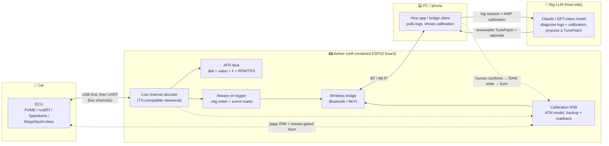

**Read it as:** Aether talks **USB/UART** to the ECU as a live-data client and (later, human-gated) calibration read/writer; it talks **BT/Wi-Fi** to a host app that hands the log + calibration to a large model and brings back a reviewable patch — never an unsupervised write back to the car. Today, only the **AFR face** block is real (host mockup); every other block is planning spec in the linked issues.

## Status

**Spec-learning mockup (this pass).** Host-runnable AFR screen with **simulated** AFR, RPM, and TPS — not live OBD/CAN, not full metal product acceptance. Layers 2–5 above are **planning specs only** (linked issues), not implemented; track readiness honestly by layer rather than assuming the roadmap is shipped.

| Layer | Status |
|-------|--------|
| AFR face (host mockup) | **In scope / present** |
| Live serial/USB ECU link ([#5](https://github.com/tig/aether/issues/5)) | Planning spec only |
| Always-on multi-channel logging ([#2](https://github.com/tig/aether/issues/2), [#3](https://github.com/tig/aether/issues/3)) | Planning spec only |
| Full calibration R/W + burn validation ([#4](https://github.com/tig/aether/issues/4)) | Planning spec only |
| Wireless LLM host bridge ([#1](https://github.com/tig/aether/issues/1)) | Idea / not designed in a spec yet |
| Metal AMOLED product face | Not done |

## Specs

| Document | Scope |
|----------|--------|
| **[specs/spec.md](specs/spec.md)** | Product requirements: mission, device, what makes AFR **useful** (context, units, logging, alarms, …) |
| **[specs/afr-face.md](specs/afr-face.md)** | **AFR screen only** — layout, dial, type, on-screen RPM/TPS |
| **[specs/lexicon.md](specs/lexicon.md)** | Face phrase book |
| [spec.md](spec.md) | Short seed pointer → `specs/` |
| *planned* `specs/inputs.md` | Live serial/USB ECU channel model — spec lives in [issue #5](https://github.com/tig/aether/issues/5) until implementation ships it |
| *planned* `specs/logging.md` | Log format, markers, LogWorks/MLV export — spec lives in [issue #3](https://github.com/tig/aether/issues/3) until implementation ships it |
| *planned* `specs/maps.md` (or `tune.md`) | Full calibration R/W, ATM/AMP/TunePatch, burn validation — spec lives in [issue #4](https://github.com/tig/aether/issues/4) until implementation ships it |

Host path: [install/README.md](install/README.md).

## Roadmap (open issues)

Each issue below carries a full planning spec in its body — that spec becomes the matching `specs/*.md` file (and this table can shrink) once an implementation PR actually ships the behavior. Until then, the issue is the product truth for that layer, not code.

| Issue | Title | Feeds |
|-------|-------|-------|
| [#1](https://github.com/tig/aether/issues/1) | Direct wireless bridge to a host LLM (logs + marks + calibration in, reviewed edits out) | Wireless host bridge |
| [#2](https://github.com/tig/aether/issues/2) | Always be logging, with drive tagging and voice/button event marks | → `specs/logging.md` |
| [#3](https://github.com/tig/aether/issues/3) | Log format strategy: MLVLG canonical, LogWorks/MLV/CSV/JSON export | → `specs/logging.md` |
| [#4](https://github.com/tig/aether/issues/4) | Full ECU calibration read/write (tables, curves, scalars) + burn validation | → `specs/maps.md` |
| [#5](https://github.com/tig/aether/issues/5) | Real-time ECU data formats & serial protocols (USB-first, FOME pilot) | → `specs/inputs.md` |

## Hardware

### Primary board: Waveshare ESP32-S3-Touch-AMOLED-1.8

First target while the software is still being learned/built; not the only board Aether intends to support (see [Vision](#vision)):

| Item | Detail |
|------|--------|
| Board | **Waveshare ESP32-S3-Touch-AMOLED-1.8** ([waveshare.com](https://www.waveshare.com/esp32-s3-touch-amoled-1.8.htm)) |
| Same board, different label | Bench unit was bought on Amazon as **UeeKKoo ESP32-S3-Touch-AMOLED-1.8** ([B0F242GFHK](https://www.amazon.com/dp/B0F242GFHK)) — identical ESP32-S3R8/SH8601/FT3168 design, just resold under a different brand |
| Price | **~$27–37** direct from Waveshare; the same board as the Amazon/UeeKKoo listing runs **~$50–68** — buy from Waveshare if starting fresh |
| Chip | ESP32-S3R8, dual-core Xtensa LX7 @ **240 MHz**, 8 MB PSRAM, 16 MB flash |
| Display | 1.8″ AMOLED 368×448, SH8601 driver (QSPI), FT3168 capacitive touch (I2C), Type-C USB |
| Wireless | Wi-Fi 4 (802.11 b/g/n, 2.4 GHz only) + Bluetooth LE 5 — **no Classic BT** |
| Product role | ECU monitor, logger, and calibration tool over serial/USB (CANbus reserved for later); real-time AFR gauge face |
| UI orientation | Landscape **448×368** (hard buttons + USB on top) |

### Performance floor

Everything the mockup and specs are tuned against assumes **this board's specs as the minimum viable compute for Aether**: dual-core @ 240 MHz, 8 MB PSRAM / 16 MB flash, Wi-Fi 4 + BLE 5, no hardware video/graphics accelerator beyond QSPI DMA. Any self-contained board that **matches or beats** that profile is a legitimate future target; anything meaningfully below it shouldn't be assumed capable of running the display pipeline, live ECU polling, always-on logging, and a wireless bridge at once.

### Same tier: other ESP32-S3 boards

Product intent is a **wide range of off-the-shelf hardware**, not one locked SKU — display layout code should stay portable rather than hard-baked to this one panel's geometry. These are all **self-contained** (SoC + display + touch on one board) and share enough of the Waveshare board's SH8601/FT3168 stack that driver code should be largely reusable, at roughly the same compute tier as the floor:

| Photo | Board | Display | Price (retail, USD) | Notes |
|:---:|-------|---------|----------------------|-------|
| 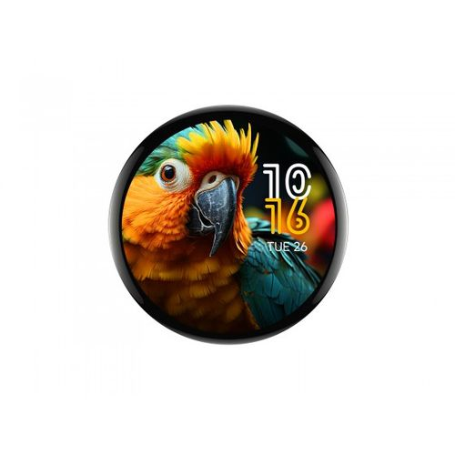 | **Waveshare ESP32-S3-Touch-AMOLED-1.75 / 1.75C** | 1.75″ **round** 466×466, SH8601 | **~$23–27** | Round face — natural fit for a dial gauge; `.75C` adds an aluminum case |
| 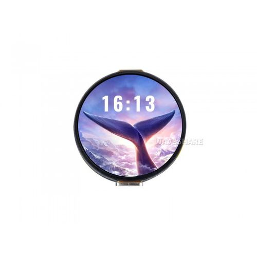 | **Waveshare ESP32-S3-Touch-AMOLED-1.32** | 1.32″ round, SH8601 | **~$20–23** | Smaller/cheaper round option |
| 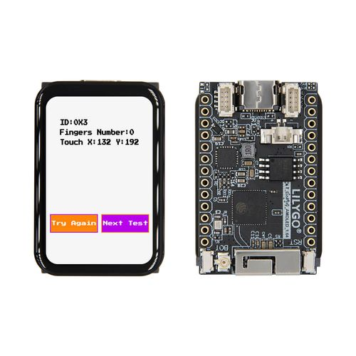 | **LILYGO T-Display-S3 AMOLED (1.43″)** | 466×466-class panel, pill-shaped board, SH8601, FT3168 touch (touch variant) | **~$30** | Adds SY6970 Li-ion charge management — good for a battery-powered handheld build |
| 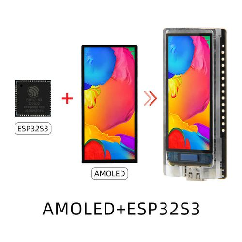 | **LILYGO T-Display-S3 AMOLED (1.91″ strip)** | 240×536, SH8601 | **~$30–33** | Tall/narrow strip; suits a ticker-style secondary gauge page |
| 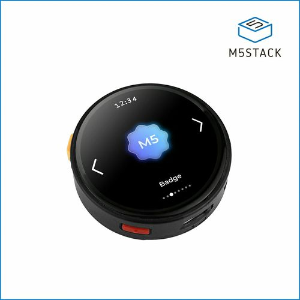 | **M5Stack StopWatch** | 1.75″ round 466×466 | **~$45** | ESP32-S3, 16 MB flash / 8 MB PSRAM, mic + speaker, buttons, vibration motor, IMU, RTC — closest to a finished wearable form factor |

### Higher tier: more headroom than the floor

Not limited to Espressif's S3 line. **ESP32-P4** is Espressif's newer RISC-V application processor: no wireless silicon on the P4 die itself, but every self-contained board below already bundles a companion **ESP32-C6** for Wi-Fi 6 + BT 5, so "self-contained" still holds. **RP2350** (Raspberry Pi's own silicon) is the one non-Espressif family with a shipping self-contained, Wi-Fi-capable touch-display board — plain STM32/nRF52/nRF5340 boards were **not** included here because none ship integrated wireless on the same board; they'd need an added radio module to meet the "self-contained bridge to a host" requirement.

| Photo | Board | CPU vs. floor | RAM/flash vs. floor | Wireless vs. floor | Price (retail, USD) | Notes |
|:---:|-------|---------------|----------------------|---------------------|----------------------|-------|
| 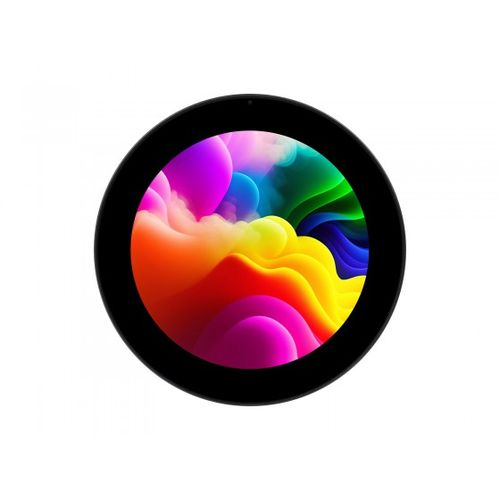 | **Waveshare ESP32-P4-WIFI6-Touch-LCD-3.4C / 4C** | RISC-V dual-core @ 400 MHz (~1.7×) + HW 2D GPU/JPEG codec | 32 MB PSRAM / 32 MB flash (**4× / 2×**) | Wi-Fi 6 + BT 5 via bundled ESP32-C6 (**exceeds**) | **~$20–78** | Round 800×800 / 720×720 IPS touch; MIPI-CSI camera header; natural dial-gauge shape |
| 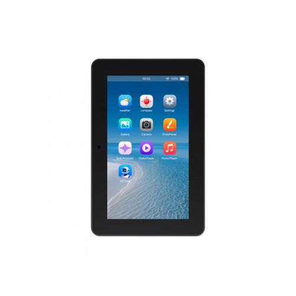 | **Waveshare ESP32-P4-WIFI6-Touch-LCD-7/8/10.1** | Same P4 core | 32 MB / 32 MB | Wi-Fi 6 + BT 5 | Not researched in USD | Tablet-class HMI panels; overkill for a pocket gauge, but the 7″ variant already breaks out **RS-485/CAN headers** — worth watching if Aether ever needs onboard CAN |
| 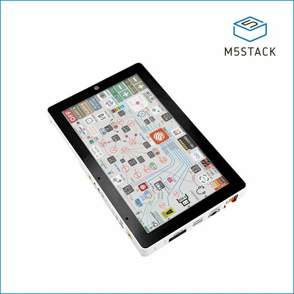 | **M5Stack Tab5** | RISC-V dual-core @ 400 MHz | 32 MB PSRAM / 16 MB flash | Wi-Fi 6 + BT 5.2 | **~$55–60** | 5″ 1280×720 IPS touch, camera, USB-A host, RS-485, swappable battery — most "finished tablet" of the bunch |
| 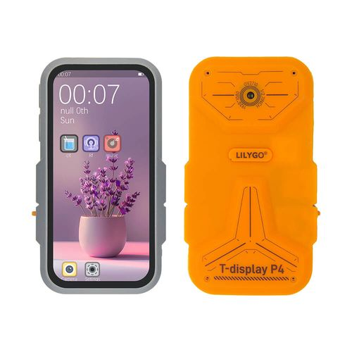 | **LILYGO T-Display-P4** | RISC-V dual-core @ 400 MHz | 32 MB PSRAM / 16 MB flash | Wi-Fi 6 + BT 5 via C6, **plus SX1262 LoRa + GPS** | **~$97–136** | 4.1″ AMOLED 568×1232; LoRa opens a long-range wireless bridge option beyond BT/Wi-Fi range for [issue #1](https://github.com/tig/aether/issues/1) |
| 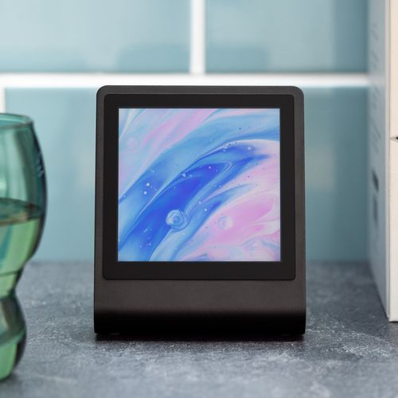 | **Pimoroni Presto (RP2350)** | Dual Cortex-M33 / Hazard3 RISC-V @ 150 MHz — roughly **at or slightly below** the floor's raw CPU | 8 MB PSRAM / 16 MB flash — **matches** floor | Wi-Fi 4 + BT via RM2 module — **matches** floor | **~£69 (~$85–90)** | Different silicon family entirely (Raspberry Pi, not Espressif); square 480×480 IPS touch, MicroPython-first; doesn't clearly beat the floor, but proves the display/touch pattern isn't Espressif-only |

Prices are approximate street prices at time of writing (retailer/region dependent) — re-check before buying. None of the boards in either table are validated on Aether yet; these are candidate lists for future portability work, not a promise any of them boot today. Photos are vendor product images (Waveshare, LILYGO, M5Stack, Pimoroni), included for form-factor reference only.

## AFR gauge mockup (host)

Simulated landscape face: **dial**, large AFR **value** with **lambda** to the right, **RPM** / **TPS** (to **WOT**) below, **banner** with MODE/SEL labels and logging LED, **swipe** dots. Rebuild from [specs/afr-face.md](specs/afr-face.md).

```text
# From the aether product root (Python 3.11+)
python -m mockup
python -m mockup.capture          # PNG frames (needs ImageMagick magick)
python -m mockup.capture --html   # + Edge/Chrome headless of gauge.html

# Unit tests (pure mapping + simulator — no display required)
python -m pytest mockup/tests -q

# Open the graphical mockup in a browser
# mockup/gauge.html
```

`python -m mockup` prints a short simulated stream and writes SVG under `mockup/out/`.
**Agents must run `python -m mockup.capture` and open the PNGs** after visual layout changes — do not claim the face looks right from code alone. Pure mapping lives in `mockup/afr_gauge.py`.

## Host gate (C plate)

```text
cmake -S host -B build/host
cmake --build build/host --target host_test
silico gate
```

Plus mockup tests above for the AFR face learning path.

## Deploy (later metal — not this pass)

```text
silico inspect --port COMx
silico deploy --port COMx --yes --verify --reset
```

Requires ESP-IDF. Metal product face on the AMOLED is **out of gate** for this bootstrap.

## Layout

| Path | Role |
|------|------|
| `specs/spec.md` | Product requirements |
| `specs/afr-face.md` | AFR screen contract |
| `specs/lexicon.md` | Phrase book |
| `mockup/` | Host AFR face mockup + unit tests |
| `firmware/` | ESP-IDF app (plate) |
| `host/` | C host tests |
| `install/` | Update-path notes |
