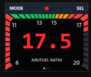

# Aether AFR screen — face specification

**Rev 0.5 · July 2026**  
**Writing mode:** Technical (STE bias).  
**Scope:** The AFR screen only (layout, dial, type, on-screen RPM/TPS, banner, swipe).  
**Not in scope here:** product-wide logging architecture, setup flows, multi-channel policy, alarms product design. See [spec.md](spec.md).

**Status:** The host mockup is the working visual reference for this screen. Implement on metal later. Do not invent a second layout in chat.

Phrase book: [lexicon.md](lexicon.md).  
Product requirements: [spec.md](spec.md).  
Reference implementation: `mockup/` (Python mapper + SVG + HTML canvas).

---

## 1. Goal

This screen is a landscape wideband-style AFR page on the Aether AMOLED.

The operator must be able to:

1. Read the AFR **value** at a glance, with **lambda** to its right.
2. Read mixture band from **dial** segments (green / amber / red). The **dial legend** marks 8–20.
3. See physical **MODE** / **SEL** names in the **banner**, and logging state via a LED **status indicator**.
4. Read live **RPM** and **TPS** in the **aux readouts** under the dial.
5. See the **swipe indicator** for other pages (those pages have their own specs later).

**Reference motion (host mockup):**



Rebuild to match this structure. After layout changes, run `python -m mockup.capture` and inspect the PNGs. Do not claim the face is correct from code alone.

This screen is not a pixel clone of a commercial 52 mm gauge. Simulated AFR/RPM/TPS is acceptable for host mockups. Live sources are product-level ([spec.md](spec.md)).

---

## 2. Orientation on the chosen device

| Item | Spec |
|------|------|
| Native panel | **368 × 448** |
| This screen’s logical pixels | **448 × 368** landscape |
| Rotation | USB + hard buttons on the **top** edge |
| Hard buttons | Physical only; on-screen MODE/SEL are **button labels**, not touch targets |

Host prototype: ~true physical size of the 1.8″ panel (≈ 1.391 in × 1.143 in landscape at CSS 96 px/in).

---

## 3. Lexicon (this screen)

Use these names; full list in [lexicon.md](lexicon.md).

| Term | Role on this screen |
|------|---------------------|
| **banner** | Top strip: button labels + status indicators |
| **dial** | Multi-segment LED ring + rounded aperture |
| **button labels** | MODE (left), SEL (right) |
| **dial legend** | 8 · 11 · 13 · 15 · 17 · 20 inside the aperture |
| **value** | Large AFR numeric |
| **lambda** | λ to the right of the value (~75% of value size) |
| **aux readouts** | RPM (left) and TPS (right) below the dial |
| **swipe indicator** | Page dots at the bottom |
| **status indicators** | Logging LED (and future LEDs) in the banner |

---

## 4. Screen layout (448×368)

```
Y=0  ┌────────────────────────────────────────────┐
     │  MODE          ● (log LED)           SEL   │  ← banner
     ├────────────────────────────────────────────┤
     │ ████████  dial (full width)          █████ │
     │ ██   dial legend   value  λ           ██  │
     │ ██  8 (corner)              20 (corner)██  │
     ├────────────────────────────────────────────┤
     │     RPM 1234              42% / WOT        │  ← ~30% of face: aux readouts
     │      RPM                    TPS            │
     │              ● ○ ○  swipe indicator       │  ← overlay
Y=H  └────────────────────────────────────────────┘
```

### 4.1 Regions

| Region | Intent |
|--------|--------|
| **Banner** | Top strip (~60 px at this resolution): MODE · log LED · SEL on a **distinct** background from the dial |
| **Dial** | Full width; height is everything under the banner **except** the bottom ~**30%** of the face. Start/end of the dial (8 and 20) sit at the **bottom of the dial region**. |
| **Aux readouts** | Bottom ~**30%** of face height: **RPM** left, **TPS** right, each with a small legend under the number |
| **Swipe indicator** | Overlay near the face bottom; does not add an extra dead strip that shrinks the dial |

### 4.2 Dial geometry (structural)

Center of the dial band:

```
aux_h      ≈ 0.30 * H
dial_bot   = H - aux_h
cx         = W / 2
cy         = BANNER_H + (dial_bot - BANNER_H) / 2
outer_half_w = W / 2
outer_half_h = (dial_bot - BANNER_H) / 2
```

**Constant band thickness** (mid-side width equals mid-top height):

```
BAND_FRAC ≈ 0.154
band = min(outer_half_w, outer_half_h) * BAND_FRAC
inner_half_w = outer_half_w - band
inner_half_h = outer_half_h - band
inner_corner ≈ 0.253 * min(inner_half_w, inner_half_h)
```

- **Outer:** sharp rectangle flush L/R of the face; top under banner; bottom at `dial_bot`.
- **Inner:** rounded rectangle aperture.
- Raycast from `(cx, cy)` with  
  `x = cx + r·cos(a)`, `y = cy − r·sin(a)`.

### 4.3 Dial arc (segments)

| Parameter | Value |
|-----------|--------|
| Segment count | **35** |
| Start | Bottom-left **corner** of outer rect |
| End | Bottom-right **corner** of outer rect |
| Path | Via the **top** |

```
start_deg = degrees(atan2(-outer_half_h, -outer_half_w))  # normalize to [0,360) if needed
end_deg   = degrees(atan2(-outer_half_h,  outer_half_w))
sweep_deg = start_deg - end_deg
```

Segment `i` spans `start_deg − (i/n)·sweep` … `start_deg − ((i+1)/n)·sweep` (small angular gaps between LEDs).

**Needle:** light indices `0 .. lit_count−1` for rising AFR.  
**Unlit:** still drawn, dim but **visible** on black (not black-on-black).

### 4.4 Stoich mark

Segment containing **14.7** stays softly highlighted when not fill-lit.

---

## 5. AFR mapping (pure logic)

| Symbol | Value |
|--------|--------|
| AFR_MIN / AFR_MAX | 8.0 / 20.0 |
| AFR_STOICH | 14.7 |
| SEGMENT_COUNT | 35 |

| Condition | Band |
|-----------|------|
| out of [8, 20] | invalid |
| &lt; 11.5 | red (rich) |
| 11.5 … 15.0 | green |
| 15.0 … 15.8 | amber |
| ≥ 15.8 | red (lean) |

Each segment’s **fixed** color comes from its midpoint AFR.  
Lit count: map clamped AFR through the **non-linear arc map** (§6.3) to `1 … n` segments from the rich end.  
**Value** string: one decimal, or `--.-` if invalid.

See `mockup/afr_gauge.py`.

**Lit colors (reference):** green `#22c55e`, amber `#f59e0b`, red `#ef4444`; unlit `#2e2e36`.

---

## 6. Typography and placement (intent)

This screen is about 1.8″. Type must stay legible at physical size. Prefer hierarchy over magic ratios. `mockup/` is a tuned reference.

### 6.1 Hierarchy

1. **Value** — dominant.  
2. **Value legend** — tight under the value.  
3. **Dial legend** — tertiary scale marks.  
4. **Aux numbers** (RPM / TPS) — clear secondary telemetry.  
5. **Button labels** — only text that names hard keys.

### 6.2 Placement

| Element | Requirements |
|---------|----------------|
| **Button labels** | Banner: MODE left, SEL right, vertically centered; light ink on banner |
| **Status LED** | Banner center; no “LOG” text on the face |
| **Dial legend** | **Inside** the aperture (not on LED segments); 8 and 20 at bottom corners of the dial |
| **Value** | Large AFR in the dial aperture (dominant). Color matches current band. |
| **Lambda** | Immediately to the **right** of the value, ~**75%** of value font size, same color; two decimals (AFR ÷ 14.7 gasoline stoich for display). No `AIR/FUEL RATIO` under-text. |
| **RPM** | Left of aux zone; number with **RPM** caption **flush to the bottom** of the face |
| **TPS** | Right of aux zone; number or **WOT** with **TPS** caption **flush to the bottom** of the face |
| **Swipe indicator** | Bottom center overlay (must not force RPM/TPS captions smaller than the floor) |

### 6.3 Size intent and legibility floors

**Product rules ([spec.md](spec.md) §3.3.1):**

1. **Label floor** — banner button-label size is the base for chrome text.
2. **Legend floor** — dial legend and RPM/TPS captions must be **≥ 25% larger** than the banner label size (do not shrink below this).
3. **Primary value floor** — AFR **value** must never go below the current shipping primary size (**≥ 107 px** at 448×368).
4. **Secondary value floor** — **RPM** and **TPS**/WOT numbers must never go below the current shipping secondary size (**≥ 53 px** at 448×368).
5. **Lambda** is ~75% of the primary value size (not a “legend”; it is a companion unit reading).
6. Primary &gt; lambda ≳ secondary &gt; legend floor &gt; label floor. Do not shrink values to fit more chrome.

- **Value:** as large as practical above the primary floor; dominant. **Color matches the current mixture band**.
- **Lambda:** same color as value; right of value; readable but clearly secondary to AFR.
- **Dial legend / RPM·TPS captions:** at least the legend floor; dial legend inside the aperture; RPM/TPS captions flush to the bottom.
- Judge at **physical ~1.8″** size, not only when zoomed.

**Dial scale (non-linear):** the arc is **not** linear in AFR. Expand the important midrange so **11** and **17** sit **near the bottom corners** (with 8 and 20); compress 8–11 and 17–20 so those end zones do not dominate the dial. Control points (AFR → arc fraction): **8→0**, **11→0.14**, **17→0.86**, **20→1**. Needle and segment colors use the same map.

**Dial band:** LED segment thickness is constant on mid-sides and mid-top; keep segments substantial.

### 6.4 TPS display on this screen

- Partial throttle: integer percent (`0%` … `99%`).
- Full throttle: **`WOT`**, not `100%`.

### 6.5 Fonts

- **Value** and aux numbers: bold monospaced digits.  
- Legends and button labels: clean sans-serif.  
- Value color: strong red; legends light/muted gray; aux numbers light on black.

---

## 7. Banner and logging LED (this screen)

- Banner: distinct dark blue-slate vs dial black; light MODE/SEL for contrast.  
- Logging LED: **bright red** when on (optional pulse); **dim red** when off (still red, not gray).  
- Host demo may start off then turn on after a short delay.

---

## 8. Swipe indicator

Three page dots; active page brighter. Page 0 = this AFR screen. Other pages are out of scope here.

---

## 9. Interaction (this screen)

| Input | Behavior |
|-------|----------|
| Physical MODE / SEL | Product semantics in product/setup specs; labels only on mockup |
| Swipe L/R | Change page via swipe indicator |
| Logging | Status LED only |

Do not implement MODE/SEL as on-screen touch buttons on this face.

---

## 10. Z-order

1. Face black  
2. Dial segments  
3. Dial legend, value, lambda  
4. Aux RPM / TPS  
5. Banner + edge  
6. Button labels + status LED  
7. Swipe indicator  

---

## 11. Host verification (agents)

```text
python -m pytest mockup/tests -q
python -m mockup.capture
# Inspect mockup/out/preview_*.png
```

### Acceptance (AFR screen)

- [ ] Landscape 448×368; banner distinct; MODE / LED / SEL legible  
- [ ] Dial full width; dial bottom ≈ value legend bottom; ~30% aux below  
- [ ] 35 segments; 8 / 20 at dial bottom corners  
- [ ] Equal mid-side and mid-top band thickness  
- [ ] Unlit segments visible; stoich soft-highlight  
- [ ] Value dominates; lambda to the right at ~75% size; no AIR/FUEL RATIO under-text  
- [ ] RPM left, TPS right; WOT at full throttle  
- [ ] Swipe dots at bottom  
- [ ] Mapping unit tests pass  
- [ ] Visual capture inspected  

---

## 12. Implementation map

| Concern | Owner |
|---------|--------|
| Pure AFR → segments | `mockup/afr_gauge.py` |
| Layout + SVG | `mockup/run.py` |
| HTML prototype | `mockup/gauge.html` |
| PNG capture | `mockup/capture.py` |
| Unit tests | `mockup/tests/` |
| This screen contract | `specs/afr-face.md` |
| Product requirements | `specs/spec.md` |
