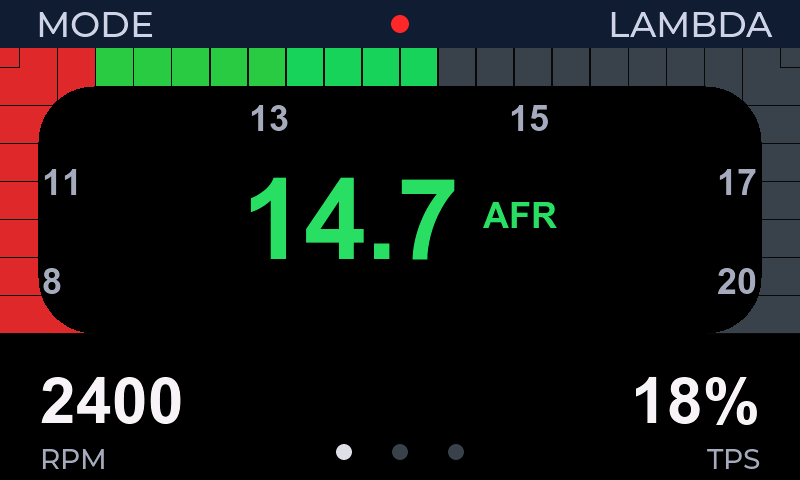
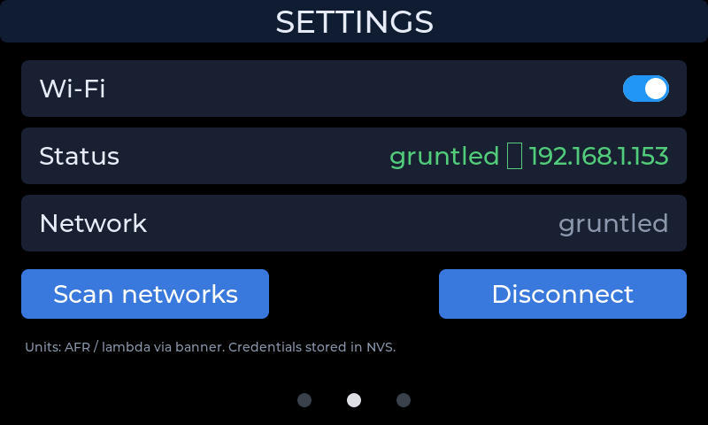
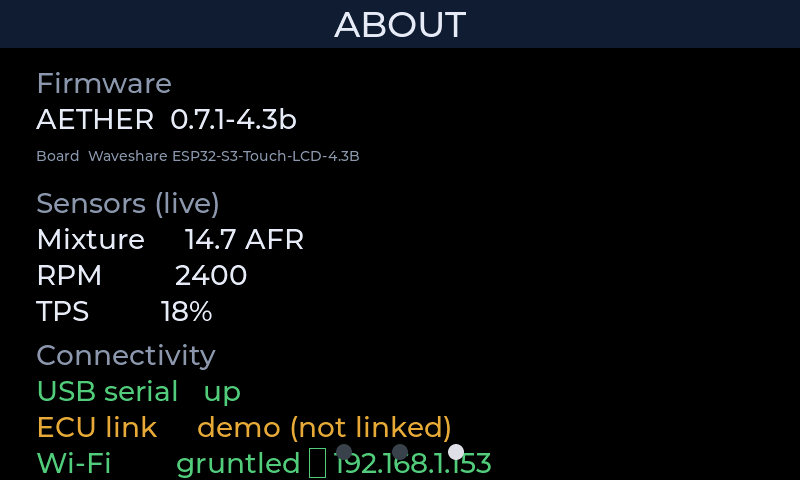

# Aether pages — navigation, settings, about

**Rev 0.1 · August 2026**  
**Scope:** Multi-page product UI on the 4.3″ face: which pages exist, how the operator moves between them, what SETTINGS and ABOUT must provide.  
**Not in scope:** AFR dial geometry (see [afr-face.md](afr-face.md)); host demo phases (see [afr-demo.md](afr-demo.md)); Wi‑Fi stack internals.

Phrase book: [lexicon.md](lexicon.md). Product mission: [spec.md](spec.md).

**Status:** Metal truth for layout is the **esprec captures** below. Requirements here win over incidental UI chrome in firmware.

---

## Page set (must)

The product face **must** present at least these three pages, in this order:

| # | Page | Role |
|---|------|------|
| 0 | **AFR** | Primary mixture instrument ([afr-face.md](afr-face.md)) |
| 1 | **SETTINGS** | Operator configuration (connectivity first; more later) |
| 2 | **ABOUT** | Identity, live sensors, connectivity status |

Additional pages may be added later. Page order **must** stay stable once shipped (dots index is operator muscle memory).

### Metal reference (800 × 480)

**AFR**

**SETTINGS**

**ABOUT**

Captures: device framebuffer via esprec (`page afr` / `page settings` / `page about`). Re-shoot after layout changes that alter operator-visible structure.

---

## Navigation (must)

### Goals

The operator **must** move between pages without a keyboard and without leaving the car workflow.

| Input | Requirement |
|-------|-------------|
| **Horizontal swipe** | Must change to the adjacent page. Must feel continuous and reliable on capacitive glass. |
| **Swipe dots** | Must show current page. Must accept a **tap** to jump to that page. Must remain visible on every page. |
| **Hit reliability** | Taps on dots and on interactive chrome **must not** be swallowed by page swipe (or the reverse: short taps must not require perfect stillness). |

### Non-requirements (leave to implementation)

- Exact widget library or gesture engine is **not** prescribed. Prefer **proven, maintained UI toolkit features** for paging and hit-testing over product-specific swipe math.
- Animation style (snap vs slide) is free as long as the operator can predict the next page.

### Acceptance

- [ ] Swipe left/right changes page; dots match active page  
- [ ] Tap each dot jumps to that page  
- [ ] Short taps on controls on a page do not accidentally change page under normal finger contact  
- [ ] Dots remain tappable on SETTINGS and ABOUT (not covered or hidden)

---

## SETTINGS page (must)

### Purpose

Give the operator **on-device control** of product options that cannot wait for a host tool. First ship includes **Wi‑Fi**.

### Required content

| Control | Requirement |
|---------|-------------|
| **Wi‑Fi enable** | On/off. State **must** persist across reboot. |
| **Status** | Human-readable: off, connecting, failed, or connected with identity (SSID and/or IPv4). |
| **Network** | Shows selected / associated SSID (or clear empty state). |
| **Scan** | Lists nearby networks. List **must not** show duplicate SSIDs (one row per name; prefer strongest signal). |
| **Join flow** | Selecting a network **must** present a password field **always** (open networks: empty password is valid). Password entry **must** be readable (plain text, not only masked bullets). |
| **Connect / Disconnect** | Explicit action when credentials already exist; disconnect leaves radio policy consistent with enable switch. |

### Credentials persistence

| Event | Credentials / enable flag |
|-------|---------------------------|
| Normal **app firmware flash** | **Must survive** (separate non-volatile store from the app image). |
| Full chip erase / NVS wipe | May be cleared (operator re-joins). |
| Reboot | **Must** restore enable flag; if enabled and credentials exist, **must** attempt reconnect. |

### Non-requirements

- SoftAP captive portal, BLE provisioning, and enterprise EAP are **not** required for first ship.
- Exact SSID list UI chrome is free if scan + join requirements hold.
- Prefer **platform Wi‑Fi station APIs** (ESP-IDF or equivalent) over a bespoke radio stack.

### Host serial (optional, same product truth)

When USB serial is up, host commands **may** mirror on-device config (`wifi on` / `wifi set …`). They **must not** be the only way to configure Wi‑Fi on a touch product.

---

## ABOUT page (must)

| Block | Requirement |
|-------|-------------|
| **Firmware** | Product name + version string (matches identity on the wire). |
| **Board** | Human board identity (e.g. Waveshare 4.3B class). |
| **Sensors (live)** | Current mixture, RPM, TPS (or invalid) even while this page is front — operator must not think the instrument “stopped.” |
| **Connectivity** | At least: USB serial state; ECU link honesty (demo vs live); **Wi‑Fi** state consistent with SETTINGS. |

### Acceptance

- [ ] Version matches `identity` / fw_version  
- [ ] Live mixture/RPM/TPS update while on ABOUT  
- [ ] Wi‑Fi line tracks connected / off / other without lying

---

## Cross-page rules

1. **Demo / live sensors** continue while the operator is on SETTINGS or ABOUT (multitask). Page change **must not** freeze mixture context except during an explicit named **scene hold** for capture.  
2. **Units (AFR ↔ lambda)** are **operator-owned**. Host demo **must not** force a units toggle that fights a banner tap.  
3. Interactive overlays (scan list, password) **must** sit above page content and dismiss cleanly without stranding the UI.

---

## Where details live

| Concern | Owner |
|---------|--------|
| Page contract (this file) | `specs/pages.md` |
| AFR look | `specs/afr-face.md` |
| Product / hardware | `specs/spec.md` |
| Metal stills | `docs/images/page-*.png` |
| Capture | esprec snapshot after `page afr\|settings\|about` |
